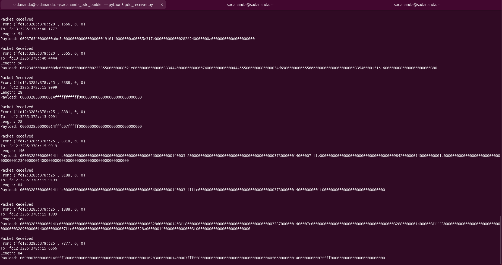
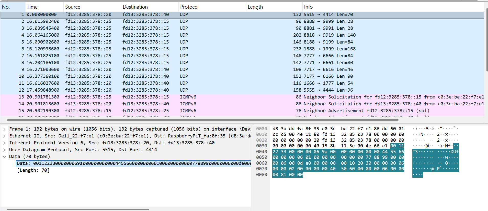
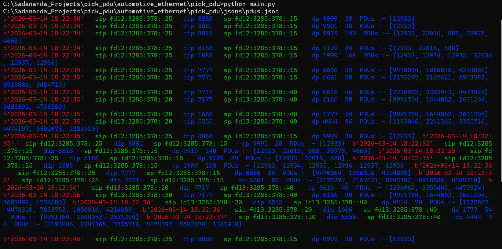

# pick_pdu – Configurable Ethernet PDU Builder & UDP Sender

## Overview

**pick_pdu** is a Python framework used for building and transmitting Ethernet PDUs over UDP.
The system allows **PDU definitions through JSON configuration**, enabling flexible signal-based payload construction.

This project was tested using:

- **Windows PC (Sender)**
- **Raspberry Pi (Receiver)**
- **Direct Ethernet Cable**
- **IPv6 UDP Communication**
- **Wireshark Packet Verification**

---

# Network Test Setup

Windows PC sends UDP frames to Raspberry Pi using IPv6 addresses configured manually.

```
Windows PC (Sender)
        │
        │  Ethernet Cable
        │
Raspberry Pi (Receiver)
```

---

# Configure IPv6 Addresses

## Windows Configuration

Open **Command Prompt as Administrator**.

Add IPv6 addresses:

```
netsh interface ipv6 add address "Ethernet" fd12:3285:378::25/64
netsh interface ipv6 add address "Ethernet" fd13:3285:378::20/64
netsh interface ipv6 add address "Ethernet" fd13:3285:378::45/64
netsh interface ipv6 add address "Ethernet" fd13:3285:378::3285/64
netsh interface ipv6 add address "Ethernet" fd14:3285:378::100/64
netsh interface ipv6 add address "Ethernet" fd15:3285:378::25/64
```

Verify configuration:

```
ipconfig
```

### Windows IPv6 Configuration Screenshot


---

# Raspberry Pi IPv6 Configuration

Add destination IPv6 addresses on Raspberry Pi.

```
sudo ip -6 addr add fd12:3285:378::15/64 dev eth0
sudo ip -6 addr add fd12:3285:378::8532/64 dev eth0
sudo ip -6 addr add fd13:3285:378::40/64 dev eth0
sudo ip -6 addr add fd13:3285:378::3285/64 dev eth0
sudo ip -6 addr add fd14:3285:378::50/64 dev eth0
```

Verify:

```
ip -6 addr
```

---

# Running Receiver on Raspberry Pi

Before sending packets from Windows, run the **receiver script on Raspberry Pi**.
The script is placed inside the tests folder

```
python3 pdu_receiver.py
```

The receiver listens to all configured **destination IP addresses and ports** and prints received packets.

Example output:

```
Listening on fd13:3285:378::40:1444
Packet Received
Source: fd12:3285:378::25
Payload length: 64 bytes
```



---

# Running Sender on Windows

Run the sender script:

```
python main.py
```

The sender reads the **JSON PDU configuration** and transmits packets to the destination IPs.

---

# Packet Verification using Wireshark

Open Wireshark and start capture on the **Ethernet interface**.

Filter:

```
ipv6
```

or

```
udp
```

### Wireshark Capture Example



---


### CMD Capture Example

On the cmd it appears like below when we run the sender script from windows side.



---

# Troubleshooting

## ICMPv6 Port Unreachable

If Wireshark shows:

```
ICMPv6 Destination Unreachable (Port unreachable)
```

It means the **receiver script is not running on Raspberry Pi**.

Start the receiver to resolve the issue.

---

## Incorrect IPv6 Prefix

IPv6 addresses must be added with `/64` prefix.

Correct:

```
fd12:3285:378::15/64
```

Incorrect:

```
fd12:3285:378::15/128
```

---

# Tested Environment

| Component | System |
|----------|--------|
| Sender | Windows 11 |
| Receiver | Raspberry Pi (Linux) |
| Protocol | UDP over IPv6 |
| Verification | Wireshark |

---

# Author

Mithun Thejaswini  
Automotive & Embedded Networking
